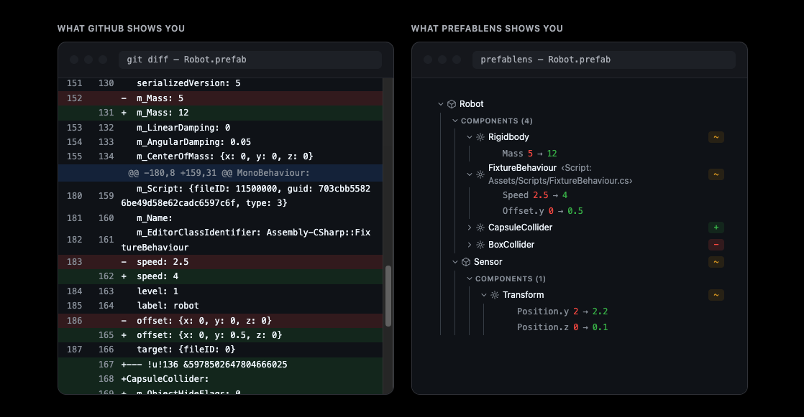
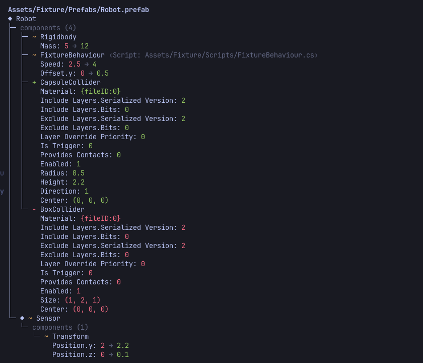

# PrefabLens

[](LICENSE)
[](https://github.com/hashiiiii/PrefabLens/releases)
[](https://github.com/hashiiiii/PrefabLens/actions/workflows/ci.yml)

**Human-readable diffs for UnityYAML assets.** Instead of raw text diffs, PrefabLens shows changes at the GameObject, component, and field level.

Try the [live demo](https://hashiiiii.github.io/PrefabLens/).

## Chrome extension (Chrome Web Store)

<p align="center">
  

  
</p>

## Unity Editor

<p align="center">
  
</p>

## CLI

<p align="center">
  
</p>

## Components

| Directory | Description |
|---|---|
| `core/` | Diff engine in Zig (shared by the CLI and WASM) |
| `cli/` | `prefablens` command-line tool |
| `extension/` | Chrome extension for semantic diffs on GitHub pull requests |
| `editor/` | Unity Editor package for semantic UnityYAML diffs |
| `site/` | Live demo site published to GitHub Pages, built from the CLI and extension artifacts |

## Installation

### Chrome extension (Chrome Web Store)

Install from the [Chrome Web Store](https://chromewebstore.google.com/detail/dlhnalbfkikchkfedfneiimadommcnip).

### CLI

#### Homebrew (macOS / Linux)

```bash
brew install hashiiiii/tap/prefablens
```

#### Scoop (Windows)

```bash
scoop bucket add hashiiiii https://github.com/hashiiiii/scoop-bucket
scoop install prefablens
```

#### mise

```bash
mise use -g github:hashiiiii/PrefabLens
```

#### Manual

Download the zip for your platform from [GitHub Releases](https://github.com/hashiiiii/PrefabLens/releases).

### Unity Editor package (OpenUPM)

Requires Unity `2022.3+`.

```bash
openupm add com.hashiiiii.prefablens
```

Without the [openupm-cli](https://github.com/openupm/openupm-cli), add the scoped registry as described on the [package page](https://openupm.com/packages/com.hashiiiii.prefablens/), or install via the Package Manager git URL: `https://github.com/hashiiiii/PrefabLens.git?path=editor`.

## Usage

### Chrome extension

Shows semantic diffs for UnityYAML files on the GitHub pull request Files changed tab. Sign in with GitHub from the first diff panel (or the extension options page); authorization uses the GitHub device flow, so no token setup is needed.

#### GitHub Enterprise

GitHub Enterprise Server and ghe.com instances are supported. Open the extension options, add
your instance URL under "Enterprise instances" (Chrome asks for host permission on that click),
reload the instance tab, and paste a personal access token with repo read access for the
instance. Sign in with GitHub (device flow) stays github.com-only.

### CLI

```bash
prefablens                              # HEAD vs working tree, all changed Unity files
prefablens Assets/Foo.prefab            # HEAD vs working tree, one file
prefablens main                         # ref vs working tree, all changed Unity files
prefablens HEAD~1 HEAD Assets/Foo.prefab  # ref vs ref, one file
prefablens before.prefab after.prefab   # plain two-file compare (no git)

prefablens --json before.prefab after.prefab
prefablens --html main                  # self-contained HTML report on stdout
prefablens --open main                  # write the report to a temp file and open it
```

Operands ending in a Unity YAML extension (`.prefab`, `.unity`, `.asset`, ...) are
treated as paths; everything else is a git ref.

Full reference — every flag, exit code, and resolution rule: [docs/cli.md](docs/cli.md).

### Unity Editor

Open `Window > PrefabLens`. The window lists every changed UnityYAML asset vs HEAD and shows the selected asset's semantic diff. The CLI binary is downloaded automatically from GitHub Releases.

Details — configuration, the CLI download, troubleshooting: [docs/editor.md](docs/editor.md).

## Supported files

Text-serialized Unity assets such as `.prefab`, `.unity`, `.asset`, `.mat`, `.anim`, and `.controller`. Excludes `.meta`, `.asmdef`, and other non-UnityYAML formats.

## Development

Toolchain is managed with [mise](https://mise.jdx.dev/) (Zig 0.16, Node 24, pnpm 11, .NET 10).

```bash
mise install

# Core / CLI
zig build test
zig build run -- before.prefab after.prefab

# WASM (for the extension)
zig build wasm

# Extension
cd extension && pnpm install && pnpm run build && pnpm test

# Editor (EditMode tests run on .NET, no Unity required)
cd editor && dotnet test DotNetTests~/Tests

# Site (build the CLI, WASM, and extension demo bundle first: `pnpm run demo`)
cd site && node --test src/*.test.mjs && node build.mjs
```

## Contributing

Contributions follow an issue-first flow: open an issue and wait for the `approved` label before sending a pull request. See [CONTRIBUTING.md](CONTRIBUTING.md) for details.

## License

[Apache License 2.0](LICENSE)
