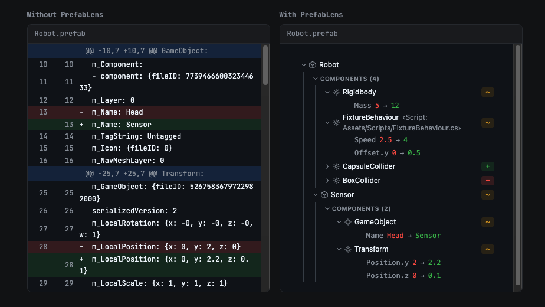
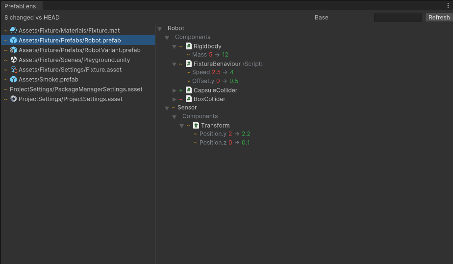
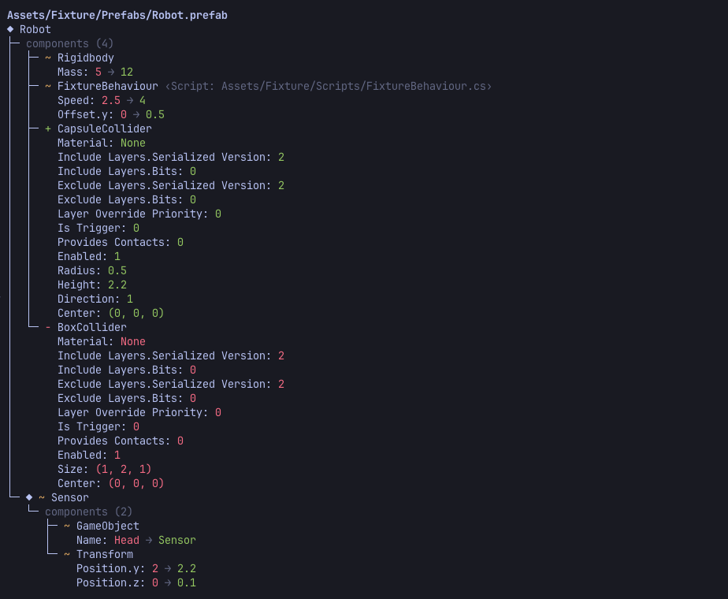

# PrefabLens

[](LICENSE)
[](https://github.com/hashiiiii/PrefabLens/releases)
[](https://github.com/hashiiiii/PrefabLens/actions/workflows/ci.yml)

PrefabLens shows human readable diffs of UnityYAML assets.
A semantic diff shows changes at the GameObject, component, and field level.

A [live demo](https://prefablens.hashiiiii.workers.dev/) is available.

## Chrome extension (Chrome Web Store)

<p align="center">
  
</p>

## Unity Editor

<p align="center">
  
</p>

## CLI

<p align="center">
  
</p>

## Components

| Directory    | Description                                                                              |
| ------------ | ---------------------------------------------------------------------------------------- |
| `core/`      | Zig diff engine for the CLI and WASM                                                     |
| `cli/`       | `prefablens` CLI tool                                                                    |
| `extension/` | Chrome extension. The extension shows semantic diffs on GitHub pull requests.            |
| `editor/`    | Unity Editor package for semantic diffs                                                  |
| `site/`      | Live demo on Cloudflare Workers. The demo uses artifacts from the CLI and the extension. |

## Installation

### Chrome extension (Chrome Web Store)

Install the extension from the [Chrome Web Store](https://chromewebstore.google.com/detail/dlhnalbfkikchkfedfneiimadommcnip).

### CLI

#### Homebrew (macOS / Linux)

```bash
brew install hashiiiii/tap/prefablens
```

#### Scoop (Windows)

```bash
scoop bucket add hashiiiii https://github.com/hashiiiii/scoop-bucket
scoop install prefablens
```

#### mise

```bash
mise use -g github:hashiiiii/PrefabLens
```

#### Manual

Download the zip for your platform from [GitHub Releases](https://github.com/hashiiiii/PrefabLens/releases).

### Unity Editor package (OpenUPM)

Unity `2022.3+` is required.

```bash
openupm add com.hashiiiii.prefablens
```

If you do not use [openupm-cli](https://github.com/openupm/openupm-cli), add the scoped registry as described on the [package page](https://openupm.com/packages/com.hashiiiii.prefablens/).
Alternatively, in the Package Manager, install from the git URL `https://github.com/hashiiiii/PrefabLens.git?path=editor`.

## Usage

### Chrome extension

The extension shows human readable diffs of UnityYAML assets on GitHub pull requests.
You can authenticate with the GitHub Device Flow from the diff panel.
You do not need to set a token.

> [!NOTE]
> The extension works on github.com only.

### Git merge

PrefabLens can resolve semantic conflicts in Unity YAML files during `git merge`.
Choose one setup mode for each clone.

#### Personal repository setup

Run these commands for one clone:

```bash
git config --local merge.prefablens.driver \
  'prefablens merge-driver %O %A %B %P'
git config --local mergetool.prefablens.cmd \
  'prefablens mergetool "$BASE" "$LOCAL" "$REMOTE" "$MERGED"'
git config --local mergetool.prefablens.trustExitCode true
```

Save the attributes block below in `.git/info/attributes`.

#### Team setup

Run these commands on each clone:

```bash
git config --global merge.prefablens.driver \
  'prefablens merge-driver %O %A %B %P'
git config --global mergetool.prefablens.cmd \
  'prefablens mergetool "$BASE" "$LOCAL" "$REMOTE" "$MERGED"'
git config --global mergetool.prefablens.trustExitCode true
```

Commit the same attributes block below as `.gitattributes`.

```gitattributes
*.prefab merge=prefablens
*.unity merge=prefablens
*.asset merge=prefablens
*.mat merge=prefablens
*.anim merge=prefablens
*.controller merge=prefablens
*.overrideController merge=prefablens
*.physicMaterial merge=prefablens
*.physicsMaterial2D merge=prefablens
*.playable merge=prefablens
*.mask merge=prefablens
*.brush merge=prefablens
*.flare merge=prefablens
*.fontsettings merge=prefablens
*.guiskin merge=prefablens
*.giparams merge=prefablens
*.renderTexture merge=prefablens
*.spriteatlas merge=prefablens
*.spriteatlasv2 merge=prefablens
*.terrainlayer merge=prefablens
*.mixer merge=prefablens
*.shadervariants merge=prefablens
*.preset merge=prefablens
*.signal merge=prefablens
*.lighting merge=prefablens
*.scenetemplate merge=prefablens
```

#### Daily merge

Run the normal Git commands:

```bash
git switch feature
git merge main
```

If no semantic conflict exists, these commands complete the merge.
If a Unity YAML conflict remains, run the mergetool for that path:

```bash
git mergetool --tool=prefablens -- Assets/Prefabs/Robot.prefab
git merge --continue
```

If other file formats also conflict, specify the Unity YAML path and use the suitable tool for each other file.

### CLI

```bash
prefablens                              # HEAD vs working tree, all changed Unity files
prefablens Assets/Foo.prefab            # HEAD vs working tree, one file
prefablens main                         # ref vs working tree, all changed Unity files
prefablens HEAD~1 HEAD Assets/Foo.prefab  # ref vs ref, one file
prefablens before.prefab after.prefab   # plain two-file compare (no git)

prefablens --json before.prefab after.prefab
prefablens --html main                  # self-contained HTML report on stdout
prefablens --open main                  # write the report to a temp file and open it
```

Operands with a Unity YAML extension (`.prefab`, `.unity`, `.asset`, and more) are paths.
All other operands are git refs.

The project must use text asset serialization (Edit > Project Settings > Editor >
Asset Serialization > Force Text).
Binary-serialized assets do not produce useful diffs.

### Unity Editor

Requirements:

- Unity 2022.3 or newer
- The project is inside a git repository
- Text asset serialization (Force Text)

Open `Window > PrefabLens`.

The left pane lists every changed UnityYAML asset against the **Base** ref.
An empty **Base** ref means HEAD.
The right pane shows the semantic diff for the selected asset.
The window refreshes on focus.
The **Refresh** control also refreshes the window.

On first use, the package downloads the pinned `prefablens` CLI from GitHub
Releases into `Library/PrefabLens/`.
Git does not track this directory.

To use a local binary:

1. Open Preferences > PrefabLens.
2. Set **CLI path override** to an absolute path.

Alternatively, set the `PrefabLens.CliPath` EditorPrefs key to an absolute path.

| Symptom                                               | What to do                                                                                         |
| ----------------------------------------------------- | -------------------------------------------------------------------------------------------------- |
| `Download failed: …`                                  | Retry. If the retry fails, download the release zip. Then set the CLI path override.               |
| `prefablens exited with N` / one-line CLI error       | Make sure that the project is in a git repository. Make sure that git finishes within the timeout. |
| `Could not parse CLI output (CLI version mismatch?):` | Clear the CLI path override. Or update the binary.                                                 |
| `prefablens timed out after 90s and was killed`       | Make sure that `git status` is fast in the repository.                                             |
| Changed assets never appear                           | Switch Asset Serialization to Force Text.                                                          |

## Supported files

PrefabLens supports text-serialized Unity assets.
The supported extensions are `.prefab`, `.unity`, `.asset`, `.mat`, `.anim`, and `.controller`.
PrefabLens does not support `.meta`, `.asmdef`, or other formats that are not UnityYAML.

## Development

Install [mise](https://mise.jdx.dev/).

The toolchain is Zig 0.16, Node 24, pnpm 11, and .NET 10.

```bash
mise install

# Core / CLI
zig build test
zig build run -- before.prefab after.prefab

# WASM (for the extension)
zig build wasm

# Extension (build / test run zig build wasm when needed)
cd extension && pnpm install && pnpm run build && pnpm test

# Editor (EditMode tests run on .NET, no Unity required)
cd editor && dotnet test DotNetTests~/Tests

# Site (build the CLI, WASM, and extension demo bundle first: `pnpm run demo`)
cd site && node build.mjs
```

Related documents:

- [CLI](docs/cli.md)
- [Chrome extension](docs/extension.md)
- [Unity Editor package](docs/editor.md)

## Contributing

Open an issue first.
If the issue does not have the `approved` label, do not open a pull request.
Read [CONTRIBUTING.md](CONTRIBUTING.md).

## License

[Apache License 2.0](LICENSE)
