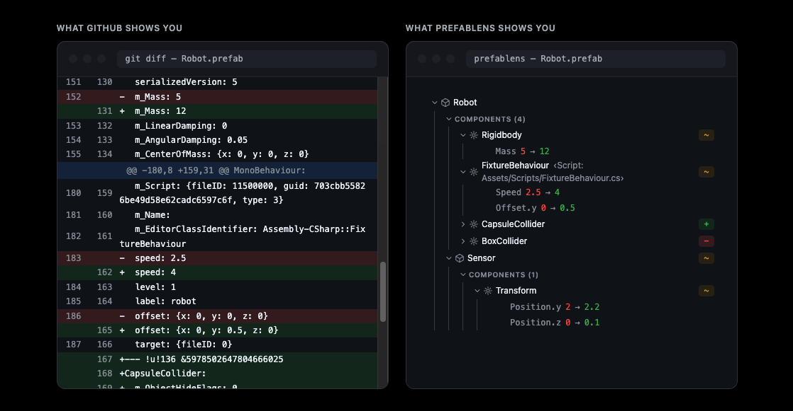
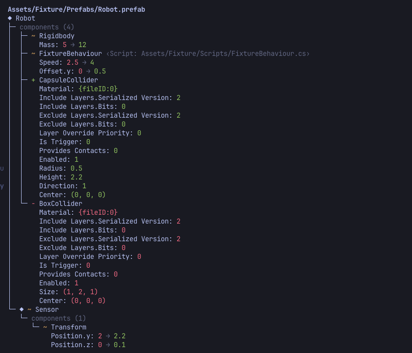

# PrefabLens

[](LICENSE)
[](https://github.com/hashiiiii/PrefabLens/releases)
[](https://github.com/hashiiiii/PrefabLens/actions/workflows/ci.yml)

PrefabLens shows human-readable diffs for UnityYAML assets.
It shows changes at the GameObject, component, and field level.

Try the [live demo](https://prefablens.hashiiiii.workers.dev/).

## Chrome extension (Chrome Web Store)

<p align="center">
  

  
</p>

## Unity Editor

<p align="center">
  
</p>

## CLI

<p align="center">
  
</p>

## Components

| Directory | Description |
|---|---|
| `core/` | Diff engine in Zig (shared by the CLI and WASM) |
| `cli/` | `prefablens` command-line tool |
| `extension/` | Chrome extension for semantic diffs on GitHub pull requests |
| `editor/` | Unity Editor package for semantic UnityYAML diffs |
| `site/` | Live demo site on Cloudflare Workers, built from the CLI and extension artifacts |

## Installation

### Chrome extension (Chrome Web Store)

Install the extension from the [Chrome Web Store](https://chromewebstore.google.com/detail/dlhnalbfkikchkfedfneiimadommcnip).

### CLI

#### Homebrew (macOS / Linux)

```bash
brew install hashiiiii/tap/prefablens
```

#### Scoop (Windows)

```bash
scoop bucket add hashiiiii https://github.com/hashiiiii/scoop-bucket
scoop install prefablens
```

#### mise

```bash
mise use -g github:hashiiiii/PrefabLens
```

#### Manual

Download the zip for your platform from [GitHub Releases](https://github.com/hashiiiii/PrefabLens/releases).

### Unity Editor package (OpenUPM)

Unity `2022.3+` is required.

```bash
openupm add com.hashiiiii.prefablens
```

If you do not use [openupm-cli](https://github.com/openupm/openupm-cli), add the scoped registry as described on the [package page](https://openupm.com/packages/com.hashiiiii.prefablens/).
You can also install from the Package Manager git URL: `https://github.com/hashiiiii/PrefabLens.git?path=editor`.

## Usage

### Chrome extension

The extension shows UnityYAML diffs in a human-readable format on GitHub pull requests.
You can authenticate with the GitHub Device Flow from the diff panel.
You do not need to set a token by hand.

> [!NOTE]
> The extension works on github.com only.

### CLI

```bash
prefablens                              # HEAD vs working tree, all changed Unity files
prefablens Assets/Foo.prefab            # HEAD vs working tree, one file
prefablens main                         # ref vs working tree, all changed Unity files
prefablens HEAD~1 HEAD Assets/Foo.prefab  # ref vs ref, one file
prefablens before.prefab after.prefab   # plain two-file compare (no git)

prefablens --json before.prefab after.prefab
prefablens --html main                  # self-contained HTML report on stdout
prefablens --open main                  # write the report to a temp file and open it
```

Operands that end in a Unity YAML extension (`.prefab`, `.unity`, `.asset`, and more) are paths.
All other operands are git refs.

The project must use text asset serialization (Edit > Project Settings > Editor >
Asset Serialization > Force Text).
Binary-serialized assets do not produce useful diffs.

### Unity Editor

Requirements:

- Unity 2022.3 or newer
- The project is inside a git repository
- Text asset serialization (Force Text)

Open `Window > PrefabLens`.
The left pane lists every changed UnityYAML asset against the **Base** ref
(empty means HEAD).
The right pane shows the semantic diff for the selected asset.
The window refreshes on focus and via **Refresh**.

On first use, the package downloads the pinned `prefablens` CLI from GitHub
Releases into `Library/PrefabLens/` (not version-controlled).

To use your own binary:

1. Open Preferences > PrefabLens.
2. Set **CLI path override** to an absolute path.
3. Or set the `PrefabLens.CliPath` EditorPrefs key to that path.

| Symptom | What to do |
|---|---|
| `Download failed: …` | Retry. Or download the release zip by hand and set the CLI path override. |
| `prefablens exited with N` / one-line CLI error | Most often the project is not in a git repo, or git timed out. |
| `Could not parse CLI output (CLI version mismatch?):` | Clear a stale CLI path override, or update the binary. |
| `prefablens timed out after 90s and was killed` | Make sure that `git status` is fast in that repository. |
| Changed assets never appear | Switch Asset Serialization to Force Text. |

## Supported files

PrefabLens supports text-serialized Unity assets such as `.prefab`, `.unity`, `.asset`, `.mat`, `.anim`, and `.controller`.
It does not support `.meta`, `.asmdef`, and other non-UnityYAML formats.

## Development

Use [mise](https://mise.jdx.dev/) to manage the toolchain (Zig 0.16, Node 24, pnpm 11, .NET 10).

```bash
mise install

# Core / CLI
zig build test
zig build run -- before.prefab after.prefab

# WASM (for the extension)
zig build wasm

# Extension (build / test run zig build wasm when needed)
cd extension && pnpm install && pnpm run build && pnpm test

# Editor (EditMode tests run on .NET, no Unity required)
cd editor && dotnet test DotNetTests~/Tests

# Site (build the CLI, WASM, and extension demo bundle first: `pnpm run demo`)
cd site && node build.mjs
```

Documents (why, design, verification, deploy):

- [CLI](docs/cli.md)
- [Chrome extension](docs/extension.md)
- [Unity Editor package](docs/editor.md)

## Contributing

Open an issue first.
Wait for the `approved` label before you open a pull request.
See [CONTRIBUTING.md](CONTRIBUTING.md).

## License

[Apache License 2.0](LICENSE)
