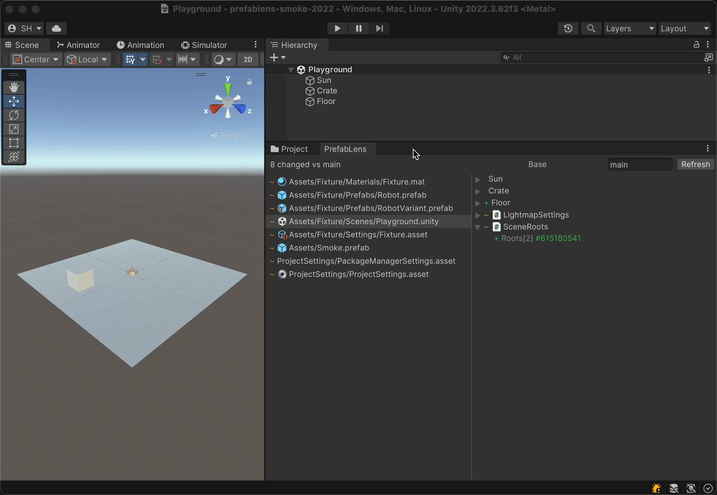

# Review changes without leaving Unity

The PrefabLens package adds an Editor window that lists every changed UnityYAML
asset in your working tree and shows each one as a semantic diff — the same
GameObject / component / field tree the CLI and the Chrome extension render.

## Changed assets, one window

Open `Window > PrefabLens`. The left pane lists the assets that differ from
`HEAD`; selecting one shows its diff tree on the right, with guid references
resolved to asset names.

<div class="window">
  <div class="window-bar">
    <span class="dot"></span><span class="dot"></span><span class="dot"></span>
    <span class="address">Unity — PrefabLens</span>
  </div>
  
</div>

## How it works

The package is pure editor code with zero dependencies. On first use it downloads
the `prefablens` CLI binary for your platform from GitHub Releases and caches it;
the window shells out to that binary for every diff. It reads the same files the
CLI does — text-serialized assets such as `.prefab`, `.unity`, `.asset`, `.mat`,
`.anim`, and `.controller`. Requires Unity 2022.3 or newer.

## Install

```sh
openupm add com.hashiiiii.prefablens
```

Without the openupm-cli, install via the Package Manager git URL:
`https://github.com/hashiiiii/PrefabLens.git?path=editor`.
